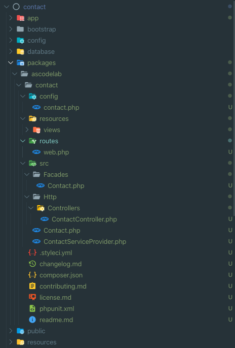

# Contact

[](https://github.com/ascodelab/contact/releases)
<!--- [](https://packagist.org/packages/ascodelab/contact) -->
[](https://packagist.org/packages/ascodelab/contact)


## Installation

Via Composer

``` bash
$ composer require ascodelab/contact
```

Publishing assets & config

``` bash
$ php artisan vendor:publish --provider="Ascodelab\Contact\ContactServiceProvider"
```

Roure for contact(test) page

``` bash
$ /contact
```

## Extending the Package

cd into your project root

``` bash 
$ mkdir ascodelab && cd ascodelab
```
Clone the package skelton

``` bash 
$ git clone https://github.com/ascodelab/contact.git
```
Now your project structure would look something like below screenshoot



## Testing the project locally

Adding package to the composer.json (require section)

``` bash 
$ "ascodelab/contact": "@dev",
```

Adding local development repository
```bash
"repositories": {
        "ascodelab/contact": {
            "type": "path",
            "url": "/usr/local/var/www/Project/packages/contact/packages/ascodelab/contact",
            "options": {
                "symlink": true
            }
        }
    }
```

Installing the local package 

``` bash 
$ composer install/update
```
Hit /contact and check if it's working fine. 

## Note
Drop an email to anela.kumar@gmail.com for any quick technical support.

## Change log

Please see the [changelog](changelog.md) for more information on what has changed recently.

## Contributing

Please see [contributing.md](contributing.md) for details and a todolist.

## Security

If you discover any security related issues, please email author email instead of using the issue tracker.

## Credits

- [Anil Sharma](https://ascodelab.github.io/-/#)

## License

license. Please see the [license file](license.md) for more information.

